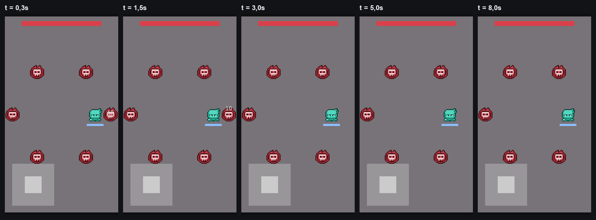

# Tower RPG

Game mobile 2D, nhìn từ trên xuống, chơi một tay trên màn hình dọc. Leo 100 tầng, đánh quái,
nâng cấp trang bị. **Cả năm mốc M1–M5 đã xong** — 100 tầng, 5 chương, 10 boss, có kết thúc.
82 test PlayMode, 64 mục kiểm scene tự động.

**Unity 6000.0.83f1 LTS · URP 2D · C#**



---

## Nguyên tắc nền: không ngẫu nhiên ở chỗ TIẾN TRÌNH, ngẫu nhiên ở chỗ NHỊP ĐÁNH

Không gacha, không hòm đồ, không tỉ lệ rơi. Mảnh rơi ra cố định, giá nâng cấp cố định,
máu quái cố định — **tiến trình của bạn không bao giờ phụ thuộc may rủi**. Đó là lời hứa
gốc và nó không đổi: khoảng cách giữa hai người chơi do chăm chỉ quyết định, không do xui.

**Chí mạng thì có.** Mỗi đòn tung một lần xúc xắc, và **cả tỉ lệ lẫn hệ số đều do VŨ KHÍ
quyết định** — nâng vũ khí thì chí mạng vừa đến nhiều hơn vừa đau hơn (25% ×2,0 ở cấp 1,
tới 45% ×7,7 ở cấp 60). Đổi lại, một trận dài vẫn tính được bằng kỳ vọng: bộ số được khớp
vào đúng đường cong DPS cũ với sai lệch tối đa 2,46%, nên toàn bộ bảng cân bằng còn nguyên
giá trị.

> Bản trước dùng *thanh dồn* — cứ đúng 5 đòn thì đòn thứ 5 chắc chắn chí mạng — và
> README này từng mở đầu bằng câu "không có yếu tố ngẫu nhiên ở bất kỳ đâu". Chủ dự án
> đổi hướng ở quyết định #40; xem `docs/DESIGN.md` để biết cái gì được đánh đổi lấy cái gì.

## Luật cốt lõi

> Di chuyển thì an toàn nhưng không gây sát thương.
> Đứng yên thì gây sát thương nhưng ăn đòn.

Không có nút tấn công. Nhân vật tự đánh kẻ gần nhất, **và chỉ khi đang đứng yên**. Một luật
duy nhất tạo ra toàn bộ sức căng — tầm đánh của quái cố ý lớn hơn tầm đánh của người chơi,
nên vào được vị trí đánh cũng là vào vị trí ăn đòn.

## Ba tầng đọc

| | Màu | |
|---|---|---|
| Thế giới | xám trung tính | nền, không tranh sự chú ý |
| Quái | **đỏ** | mối đe doạ |
| Nhân vật | **lam ngọc** | bạn, màu duy nhất không ai khác có |

Không phải chuyện thẩm mỹ mà là thứ bậc đọc trên màn hình dọc nhỏ: bạn phải theo dõi được
vị trí của chính mình *trong lúc đứng yên ăn đòn*. Năm chương đổi sắc nền, hai tầng còn lại
giữ nguyên suốt 100 tầng.

---

## Điều đáng đọc nhất ở đây không phải code

[`docs/DESIGN.md`](docs/DESIGN.md) — 570 dòng, **21 quyết định** đều ghi kèm phương án đã loại
và lý do loại. Cùng [`docs/can-bang.xlsx`](docs/can-bang.xlsx), bảng tính kiểm chứng toàn bộ
đường cong độ khó.

Tài liệu ghi thẳng những chỗ thiết kế **hỏng**, vì giấu đi thì người sau phải tự khám phá lại:

- Điều kiện *"mọi build hợp lý đều qua được tầng 100"* là **bất khả thi về mặt đại số** —
  đã thay bằng một quy tắc kiểm chứng được, không phải bằng cách chỉnh số cho đẹp.
- *"Hai hướng xây dựng đối lập"* **chưa bao giờ đúng**. Quét 420.000 cấu hình: cứu được hướng
  này *hoặc* hướng kia, **không bao giờ cả hai** — vì hai build là ảnh gương của nhau.
- **Ô Nhẫn là ô đổ rác**: 84 phép hoán vị Lõi, 0 lần có lợi.

## Quy tắc cứng: không một con số cân bằng nào nằm trong `.cs`

Tất cả ở [`m1-balance.csv`](unity/Assets/StreamingAssets/m1-balance.csv). Sửa file, chạy lại,
không cần biên dịch. Thiếu một khoá là game báo lỗi đỏ và **không khởi động trận đấu**, thay vì
âm thầm chạy với số 0.

---

## Cách chơi

### Mở game

1. Cài **[Unity Hub](https://unity.com/download)**, đăng nhập, lấy giấy phép Personal miễn phí
2. Trong Hub: **Installs → Install Editor → `6000.0.83f1`**, chọn bản **Apple Silicon** nếu dùng Mac M-series
3. **Projects → Add → Add project from disk** → trỏ vào thư mục `unity/`
4. Mở project, rồi mở scene **`Assets/Scenes/M1.unity`**
5. Bấm nút **▶ Play** trên thanh công cụ

> Lần mở đầu tiên Unity phải import gần 2.000 sprite, mất vài phút. Những lần sau nhanh.

### Điều khiển

| | |
|---|---|
| **Cần gạt ảo** góc dưới-trái | kéo để di chuyển — chuột trái trong Editor, ngón cái trên điện thoại |
| **Không có nút tấn công** | nhân vật tự đánh kẻ gần nhất, **và chỉ khi bạn đứng yên** |

Thả cần gạt ra là đánh. Kéo cần gạt là ngừng đánh ngay lập tức — kể cả hồi chiêu cũng dừng,
nên nhấp-nhả liên tục **không** giúp bạn vừa chạy vừa giữ sát thương.

### Cách chơi thật ra là gì

Bạn bắt đầu ở giữa đấu trường, **an toàn** — sáu con quái đứng thành vòng tròn quanh bạn,
ngoài tầm đánh của cả hai bên. Không có gì xảy ra cho tới khi bạn chủ động bước tới.

Tầm đánh của quái (2,8) **lớn hơn** tầm đánh của bạn (2,0). Nghĩa là để đánh được nó,
bạn buộc phải đứng trong tầm nó đánh bạn. Toàn bộ trò chơi nằm ở câu hỏi lặp đi lặp lại:

> **Đứng lại thêm một đòn nữa cho nó chết, hay lùi ra cho an toàn?**

Thanh lam dưới chân bạn là **thanh chí mạng**. Nó đầy dần sau mỗi đòn; đầy rồi thì đòn kế tiếp
nhân ba sát thương, màn hình rung, số bay lên màu vàng. Thanh **không mất** khi bạn di chuyển —
nên lùi ra chờ rồi xông vào dồn đòn chí mạng là chiến thuật hợp lệ, và là cách chơi hay nhất.

Thanh đỏ trên đỉnh là máu bạn. Hết máu thì đợt quái bày lại từ đầu, không mất gì.

### Năm điều nên để ý khi chơi

1. Giữ cần gạt → số sát thương **ngừng hiện**. Thả ra → đánh lại
2. Nhấp-nhả cần gạt liên tục → sát thương **giảm rõ rệt**
3. Đếm tay: **đúng 5 đòn một chí mạng**, không bao giờ 4 hay 6
4. Đánh 4 đòn → chạy vòng quanh → đứng lại → đòn kế **phải là chí mạng ngay**
5. Đứng yên trong tầm quái → **máu tụt thật**

### Thấy nhạt thì chỉnh gì

Sửa [`m1-balance.csv`](unity/Assets/StreamingAssets/m1-balance.csv) rồi bấm Play lại —
**không cần biên dịch, không đụng code**:

| Khoá | Thử đổi khi |
|---|---|
| `enemy.damage` | đứng yên chưa đủ đáng sợ |
| `player.attacksPerSecond` | nhịp đánh lừ đừ hoặc dồn dập quá |
| `crit.meterSize` | 5 đòn chờ quá lâu, hoặc chí mạng đến quá dễ |
| `crit.multiplier` | đòn chí mạng chưa đủ đã |
| khoảng cách `player.attackRange` ↔ `enemy.attackRange` | **đòn bẩy mạnh nhất** — nó quyết định bạn phải liều bao nhiêu |

### Chơi trên điện thoại thật

Cách nhanh: cài **Unity Remote 5** trên điện thoại, cắm dây, chọn nó ở
`Settings → Editor → Device`, rồi bấm Play. Hình stream sang máy, chạm thật trên màn hình thật.

Cách chuẩn: `File → Build Settings → Android` (hoặc iOS) → **Build And Run**.
Dự án đã khoá sẵn màn hình dọc và cài sẵn module cho cả hai nền tảng.

---

## Chạy tự động (không cần mở Unity)

```bash
cd unity
U=/Applications/Unity/Hub/Editor/6000.0.83f1/Unity.app/Contents/MacOS/Unity

# dựng lại scene M1 từ đầu
"$U" -batchmode -quit -projectPath . -executeMethod TowerRpg.EditorTools.BuildM1Scene.Build -logFile -

# soi 18 tham chiếu + 10 mục dễ hỏng
"$U" -batchmode -quit -projectPath . -executeMethod TowerRpg.EditorTools.VerifyM1Scene.Verify -logFile -

# 9 test PlayMode chạy game thật
"$U" -runTests -batchmode -projectPath . -testPlatform PlayMode -testResults ket-qua.xml -logFile -
```

Bốn trong chín test khoá chặt luật cốt lõi: đứng yên thì đánh **và** ăn đòn, di chuyển thì quái
không mất một điểm máu nào, đúng 5 đòn một chí mạng, và thanh chí mạng **không** reset khi
di chuyển. Sửa gì làm chúng đỏ thì đừng sửa test — sửa mã, hoặc thừa nhận đã đổi thiết kế.

## Cấu trúc

```
docs/            DESIGN.md · can-bang.xlsx · M1-dung-scene.md
tools/           doi-bang-mau.py — sinh mọi biến thể màu từ bản gốc
art-source/      Ninja Adventure bản gốc (CC0) — ngoài Unity, không bị import
unity/Assets/
  Scripts/       16 file mã game
  Editor/        dựng scene · kiểm scene
  Tests/         9 test PlayMode
  Art/           bản đã đổi màu + 5 nền theo chương
  StreamingAssets/m1-balance.csv
```

## Ghi công

Đồ hoạ và âm thanh: **[Ninja Adventure Asset Pack](https://pixel-boy.itch.io/ninja-adventure-asset-pack)**
của Pixel-boy & AAA, giấy phép **CC0 1.0**. Bảng màu đã được xử lý lại bằng `tools/doi-bang-mau.py`;
bản gốc giữ nguyên trong `art-source/`.

CC0 không bắt buộc ghi công — ghi ở đây vì họ xứng đáng.
