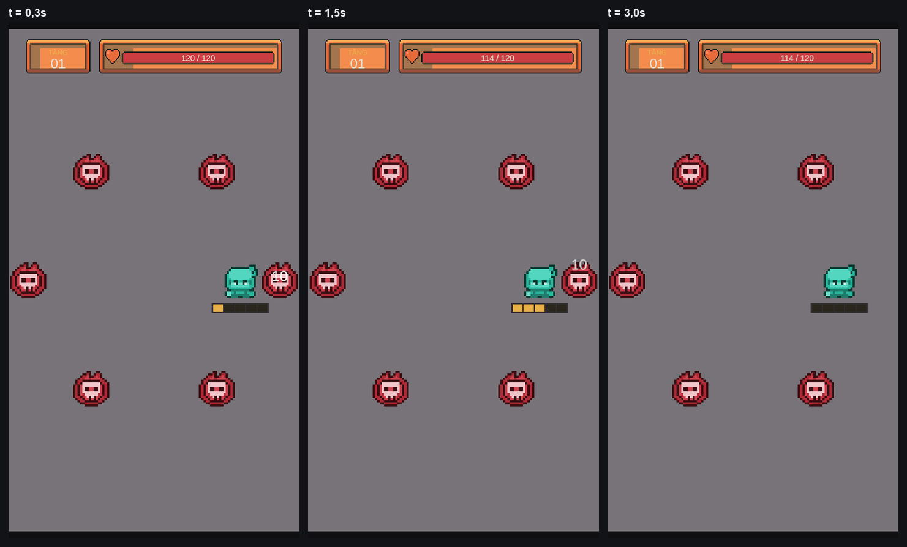
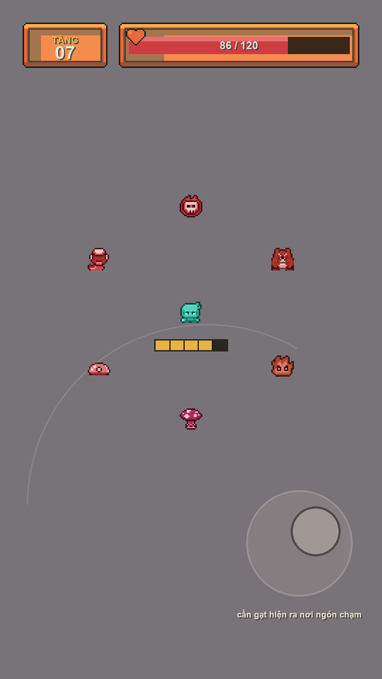
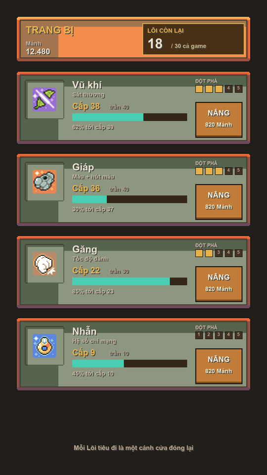

# Hệ giao diện

> Trạng thái: **ĐÃ CÀI VÀO UNITY.** Scene M1 dùng asset thật, 9-patch, cần gạt động,
> thanh chí mạng chia vạch. Kiểm chứng: 14/14 mục của `VerifyM1Scene`, 9/9 test PlayMode.

Mockup dựng bằng **asset thật** (`tools/ui/`), không phải vẽ tay — nên mọi thứ ở đây đều làm được.

---

## 1. Tầng đọc thứ tư: giao diện

§5.5b đã có ba tầng cho thế giới trong game. Giao diện là tầng **thứ tư**, và nó có một
tính chất riêng:

| Tầng | Màu | Đổi theo chương? |
|---|---|---|
| Thế giới | xám trung tính | **có** — 5 chương 5 sắc |
| Quái | đỏ | không |
| Nhân vật | lam ngọc | không |
| **Giao diện** | **gỗ / giấy / vàng đồng — ẤM** | **không** |

**Đây là sửa một lỗi đã biết.** Hiện `rule_for()` trong `tools/doi-bang-mau.py` xếp mọi thứ
ngoài `CharacterAnimated`/`Monster`/`Boss` vào tầng "thế giới" — nghĩa là thanh máu, số sát
thương và icon vật phẩm **đang bị xám hoá và sẽ đổi màu theo chương**. Thanh máu ngả ô-liu ở
chương 3 rồi ngả tím ở chương 5.

Sai. Người chơi học giao diện **một lần** rồi dùng suốt 100 tầng — y như lý do quái luôn đỏ và
nhân vật luôn lam. Giao diện phải được tách khỏi quy tắc "world" trước khi cài.

Tông **ấm** được chọn vì nó là khoảng trống duy nhất còn lại: thế giới đã chiếm xám, quái chiếm
đỏ, nhân vật chiếm lam ngọc. Gỗ và vàng đồng không lẫn vào bất cứ tầng nào, và hợp tông Đông Á
đã khoá ở quyết định #18.

## 2. Lưới và tỉ lệ

| | Giá trị | Vì sao |
|---|---|---|
| Độ phân giải thiết kế | **1080 × 1920** | Màn hình dọc, §3 giả định 2 |
| Phóng pixel | **4×** (16px → 64px) | Bội số **nguyên** bắt buộc, nếu không sẽ nhoè |
| Đơn vị khoảng cách | **32px** | Mọi lề và khe là bội của 32 |
| Lề an toàn | **64px** | Tránh bo góc và thanh cử chỉ |
| Vùng chạm tối thiểu | **144px** | Android 48dp ≈ 132px; làm tròn lên cho chẵn |
| Khe giữa hai vùng chạm | **≥ 32px** | Hướng dẫn tối thiểu là 8px, ta rộng rãi hơn |

## 3. HUD chiến đấu

Nguyên tắc: **màn hình là sân chơi, không phải bảng điều khiển.** Mọi thứ dồn ra mép, giữa để trống.

| Thành phần | Vị trí | Ghi chú |
|---|---|---|
| Số tầng | trên, trái | Khung gỗ nhỏ, đọc lướt |
| Thanh máu | trên, phần còn lại | Có số cụ thể `86 / 120`, không chỉ có thanh |
| Thanh chí mạng | **dưới chân nhân vật**, world-space | **Chia đúng 5 vạch** — đếm được bằng mắt |
| Cần gạt | **động, nửa dưới bên phải** | Hiện ra nơi ngón chạm |

**Hai quyết định đáng nói:**

**Thanh chí mạng chia vạch, không liền mạch.** §5.4 hứa "cứ 5 đòn một chí mạng". Thanh liền mạch
buộc người chơi ước lượng; thanh 5 vạch cho họ **đếm**. Nó biến lời hứa trừu tượng thành thứ
nhìn thấy được — và đó là toàn bộ lý do chọn thanh dồn thay vì xác suất.

**Cần gạt động, không cố định.** Bản M1 đặt cố định ở góc dưới-trái, mà phần lớn người chơi cầm
máy tay phải — ngón cái không với tới. Cần gạt hiện ra **nơi ngón đặt xuống** giải quyết triệt để:
không cần chọn tay, không cần với, không chiếm chỗ khi không dùng. Khoảng 20 dòng code.

## 4. Màn hình nâng cấp

Đây là nơi **quyết định thật sự** của game diễn ra, nên bố cục phục vụ đúng một việc:
làm cho sự khan hiếm của Lõi **nhìn thấy được**.

| Thành phần | Thiết kế |
|---|---|
| **Lõi** | Khung riêng, viền vàng, chữ to: `18 / 30 cả game` |
| Mảnh | Chữ thường, không viền — nó vô hạn, không đáng nổi bật |
| Bốn ô | Thẻ xếp dọc: icon · tên · chỉ số · cấp/trần · thanh tiến · cổng · nút |
| Năm cổng đột phá | Ô vàng = đã mở · ô tối kèm **số Lõi phải trả** |
| Nút | 144px cao, hai dòng: hành động + giá |
| Chân màn | *"Mỗi Lõi tiêu đi là một cánh cửa đóng lại"* |

Dòng chữ ở chân màn không phải trang trí. §5.6 nói cả game chỉ có 30 Lõi và nâng tối đa bốn ô
cần 60 — người chơi **phải** hiểu điều đó trước khi bấm, nếu không họ sẽ tiêu bừa rồi ức chế.

## 5. Đã có sẵn trong bộ asset — không phải vẽ gì

| | |
|---|---|
| `Ui/Theme/Theme Wood/` | 43 file: 9-patch panel, nút đủ 4 trạng thái, tab, slider, ô túi đồ |
| `Ui/Receptacle/` | Thanh và cầu đo, nền gỗ/tre/sắt, nhiều màu tiến trình |
| `Ui/Skill Icon/` | 62 icon — **gồm cả bốn ô trang bị** |
| `Ui/Dialog/` · `Ui/Font/` · `Ui/Emote/` | Hộp thoại, font, 30 biểu cảm |

**Bốn ô của §5.5 đều có icon sẵn:**

| Ô | File |
|---|---|
| Vũ khí | `Skill Icon/Spell/Cut.png` |
| Giáp | `Skill Icon/Items & Weapon/Armor.png` |
| Găng | `Skill Icon/Job & Action/Punch.png` |
| Nhẫn | `Skill Icon/Items & Weapon/Ring.png` |

> Sửa sai: §7 từng ghi bộ này **không có** icon cho Giáp/Găng/Nhẫn và khuyên mua bộ khác.
> Sai — tôi chỉ nhìn `Items/` mà bỏ qua `Ui/Skill Icon/`.

## 6. Đã cài

| | Trạng thái |
|---|---|
| Tách giao diện khỏi quy tắc "world" | ✅ `rule_for()` có nhánh `ui` — **359 file** giữ nguyên tông ấm |
| 9-patch từ `Theme Wood` | ✅ `UiSprite()` đặt viền rồi reimport; `Image.Type.Sliced` |
| Cần gạt động | ✅ `VirtualJoystick` viết lại — hiện ra nơi ngón chạm, ẩn khi nhấc |
| Thanh chí mạng chia vạch | ✅ `CritMeterUI` dựng đúng `crit.meterSize` vạch, **đọc từ CSV** |
| Chữ TẦNG và số máu | ✅ TextMeshPro |
| Font `NormalFont.ttf` | ⬜ **chưa** — đang dùng LiberationSans mặc định |

### Điểm kỹ thuật dễ sai nhất

**`Canvas.referencePixelsPerUnit` phải là 64.** Sprite giao diện có PPU 16 (do
`PixelArtImportSettings` ép). Tỉ lệ phóng = 64 / 16 = **đúng 4× nguyên**. Để mặc định 100
thì ra 6,25× — pixel art nhoè ngay, mà nhìn lướt rất khó nhận ra.

`VerifyM1Scene` có một mục kiểm riêng cho con số này.

### Hai lỗi gặp trong lúc cài

**Cần gạt lưu vào scene ở trạng thái đang hiện** — bị ẩn lúc `Awake` nên nó loé lên một khung
hình khi tải. Phải `SetActive(false)` ngay khi dựng scene.

**`GameObject.Find` không tìm được đối tượng đang tắt.** Vừa ẩn cần gạt đi là bộ kiểm báo
"không có" — lỗi của bộ kiểm, không phải của scene. Đã đổi sang đọc qua `SerializedProperty`.

Mockup sinh lại bất cứ lúc nào: `python3 tools/ui/hud.py` và `tools/ui/upgrade.py`.
